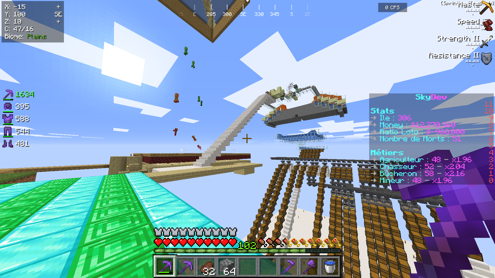

<div align="center">


A plugin crafted for a [SkyBlock](https://minecraft.wiki/w/Tutorials/Skyblock) survival experience in Minecraft, offering a wide range of features.



</div>

## ✨ Overview

- Usual SkyBlock Commands
- Custom Water-Lava Generator
- In-Game Shop
- Automatic Sell-Chests
- Chunk-Hoppers
- Custom Boosts
- Jobs System
- Lottery

### In-Game Commands

- ```/is help``` &ndash; Shows in-game commands.
- ```/is``` &ndash; Teleports to the home location of the island.
- ```/is sethome``` &ndash; Sets the home location of the island.
- ```/is lvl``` &ndash; Shows the level of the island. 
- ```/is gen``` &ndash; Shows information about the water-lava generator.
- ```/home``` &ndash; Teleports to the home location of the player.
- ```/sethome``` &ndash; Sets the home location of the player.
- ```/warp <Location>``` &ndash; Teleports to the specified location.
    - Nether
    - End
    - Lottery
- ```/jobs``` &ndash; Shows information about the different jobs.
    - Farmer
    - Hunter
    - Lumberjack
    - Miner
- ```/boosts``` &ndash; Shows information about the different boost effects.
- ```/shop``` &ndash; Opens the shop.
- ```/sell all``` &ndash; Sells all eligible items from the inventory of the player.

## 📝 How To Use

- Run [```SkyDevServer/Run.bat```](SkyDevServer/Run.bat).

---

<div align="center">
  Copyright &#169; 2021 PyroWilDx. All Rights Reserved.
</div>
